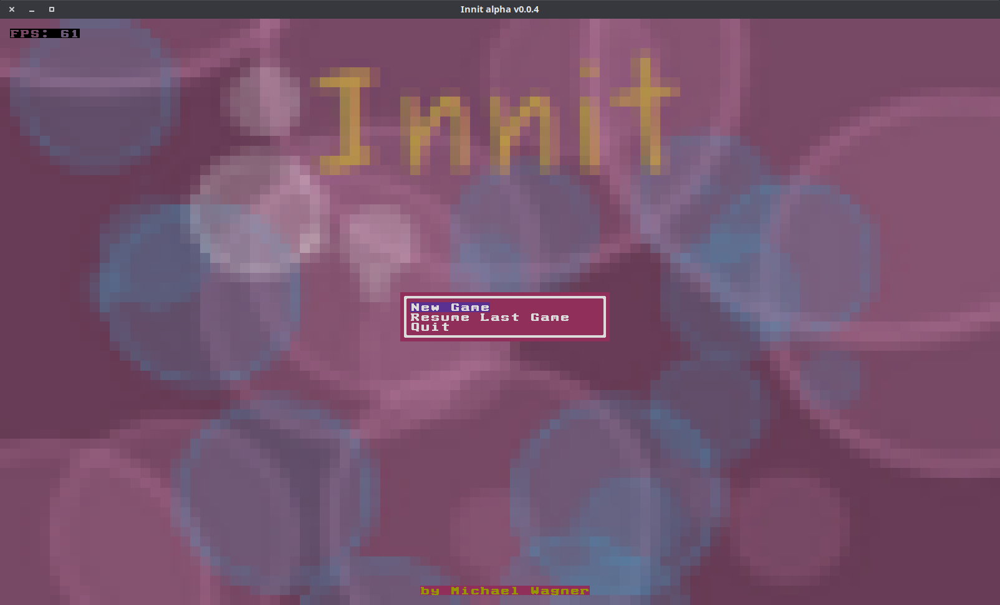

# Innit

A rogue-like game that puts you inside a living organism and lets you fight microbial invaders.

## About

You, the player, are controlling a microbe life form. The world you're living and moving in is a larger sentient organism. All around you are body cells of the host, bacteria, viruses and other microbial life. Your goal in the game is not quite determined yet, but it will revolve around helping your host to fight off diseases and prevent it from dying. After all, if your host dies, so do you! Use the host's capabilities like immune system memory, antibodies and fevers to help get rid of unwanted intruders, but be careful not to get caught in the crossfire. Immune systems are know to overreact at times or attack benign cells without hesitation.

Your microbe character is based on a strand of DNA. All attributes and skills will be encoded in it. Over the course of the game the character can extend, reduce and mutate its own DNA to lose, gain as well as change said skills and attributes.

For additional inspiration, have a look at the [Medicine and Biology](https://youtu.be/YI3tsmFsrOg) playlist of the _Kurzgesagt_ YouTube channel.

## Goal

The overall goal of this project is to create a fun, entertaining game that uses procedural (and other kinds of) content generation to maximize its depth and replayability. Innit hopes to explore some intriguing concepts of genetics and turn them into cool gameplay mechanics.

A long-term goal, would be to create an educational experience as well. Many of the planned game mechanics are based on real-life genetics and micro-organisms. There are so many interesting facets to the microbiome, the gut-brain connection and the trillions of microbes that live inside and on every one of us.

### Features, planned and implemented

- [x] A robust and flexible game engine, designed for procedurally generated content
- [x] DNA as basis of player character, NPCs and the cells of the game world itself
- [x] Horizontal and vertical transfer of genome
- [ ] Random mutation and adaptation
- [ ] A living game world, that responds to the game events with immune reactions, fever and more

## Current version

### Alpha 0.0.4

Innit is still at the outset of development. The basic game engine is, apart from a bit of polish here and there, functional.

## Screenshots




### Running the game from source

#### Linux

Run the following commands in the command line.

```bash
cargo build
```

## Known Issues

The game is being developed in Linux, but the Rust compiler should allow for Windows and Mac releases as well. As there is no playable Alpha release as of yet, multi-platform deployment has not yet been attempted.
